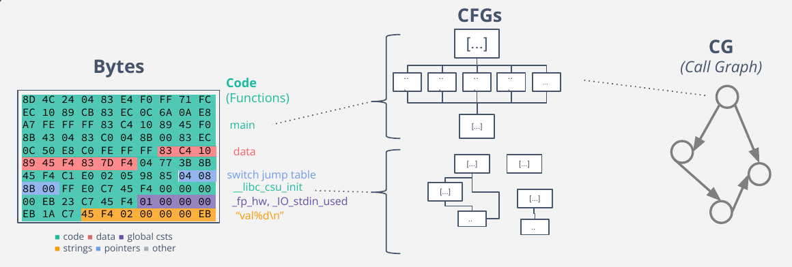

Binary diffing
==============

Before dwelling on QBinDiff inner algorithm, let's recall the two common
program representation used.

**Control-Flow Graph**

A function usually consists of several basic blocks, with transitions between these blocks occurring as a result of actions such as jumps, conditional jumps, loops, etc.
a conditional jump, loop etc. A basic block is made of instructions that are consecutively executed.
A Control-Flow Graph (CFG) represents the intra-procedural "control" relationships between basic blocks inside
a function.

**Call Graph**
A Function Call Graph follows the same principle but displays the inter-procedural relationships between
functions of a program by means of performing a call to one another.

    Disassembly steps

As depicted on the figure, the disassembly separates data and code. It then disassembles code portion to recover
disassmbled functions with the theirs CFG. The Call Graph (CG), is then another refinement representing relationships
between functions.

Supported Architectures
-----------------------

QBinDiff may theoretically support any architecture or executable formats that can be exported to BinExport or Quokka.
As such, the bottleneck for a new architecture will likely originates from the backend which itself depends on a
disassembler. Supported and tested architecures are x86, x86_64, ARMv7 and Aarch64.

QBinDiff Algorithm Overview
---------------------------

QBinDiff computes a 1-to-1 mapping between matched components. While the diff can be performed at various levels,
e.g between basic blocks or between functions, QBinDiff do it on function by default. Notwithstanding, the API
also enables performing the diff at basic block level.

.. note:: QBinDiff operates both on binaries and generic graphs. Indeed, diffing is not limited to executable binaries..
          In this context, binaries and graphs can be considered interchangeably.

While it is not required to understand the different algorithms used internally, it might be helpful
to be able to fine-tune the parameters in order to obtain better results.

From a high-level perspective, QBinDiff operates in the following steps:

1. **Attributed graph loading**. Loading the primary and secondary attributed graphs. In case of binary instance this is called **Backend loader**.
2. **Differ instanciation** with several parameters. [TODO: add link to parameters]
3. **Similarity computation**
   1. Anchoring step (between functions sure to be a match)
   2. Feature extraction: Extract various artifacts from functions
   3. Similarity matrix computation: Computes a similarity score between all functions using a linear distance function. [TODO:add link to feat]
   4. Optionally performs user-defined similarity matrix refinements
4. **Belief propagation** (leveraging the *graph topology*)
   1. Combining the similarity matrix and the topology of the CG with a state-of-the-art machine learning algorithm, called Belief Propagation, [TODO:add link]to produce the functions mapping
5. **Export the result** (in various formats)

.. note:: A key step, is the anchoring phase, only available for binaries. Indeed, binaries often contain imported
          functions. These functions can be common to primary and secondary. Using them as anchors greatly help
          the differ to obtain good matches.

The following pages will describe each step in details.
