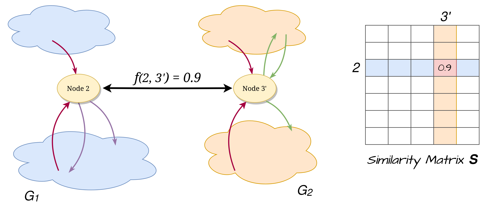

.. _features:

Similarity computation
======================

Let's consider two binaries (or attributed graphs), a *primary* with :math:`n_{1}` functions
(or nodes) and a *secondary* with :math:`n_{2}` functions (or nodes).

As we described previously the similarity between the nodes of the two input graphs is one of the
two required information for QBinDiff. We can think of it as a function that takes in input two
nodes, one belonging to the *primary* and the other belonging to the *secondary*, and returns
a normalized value between :math:`[0, 1]` that represents how similar the two nodes are, **only**
considering the node attributes.

.. math::
    f\\colon G_1 \\bigtimes G_2 \\longrightarrow [0, 1]

In practice, the function is implemented as a matrix (**S**) of shape :math:`(n_{1}, n_{2})` where
the value :math:`f(i_1, i_2) = s` is stored at position :math:`[i_1, i_2]` in the matrix :math:`S`.

From now on, without loss of generality, we are going to refer only to the similarity matrix,
without ever mentioning the function :math:`f`.

In order to keep the most versatility, in QBinDiff the similarity matrix can be partially or totally
user supplied through the **pass refinement system**. This is a system of callbacks that the user
can register with the aim of refining the values in the similarity matrix by using any kind of user
defined property. This becomes particularly useful when dealing with a problem instance that is not
related to binary diffing but that still handles attributed graphs.

For the problem of binary diffing, instead, there is already a set of heuristics that can be used
to populate the similarity matrix. These heuristics are called **features** as they characterize
the functions by extracting some information or *features*.

Features
========

*Features* are heuristics that operate at specific level inside the function (operand, instruction, basic block, function) to compute a *feature vector*. You can also think of *feature vectors* as a way of compressing the information that was extracted in a mathematical object. This information should help to characterize the function. It is an embedding of the function.

An example of a feature heuristic can be counting how many basic blocks are there in the function Control Flow Graph (CFG), we can arguably say that similar functions should have more or less the same number of blocks and by using that heuristic (or feature) we can give a score on how similar two functions are.

QBinDiff provides a lot of features an user can choose to compute the similarity. Indeed, relevant features for diffing is task-dependent and a feature may be very useful for specific diffing and useless in others. For example, the "basic blocks number" feature is useful only when we assume similar functions have the same number of blocks. If our assumption is false, namely, that two functions have been compiled with different optimization techniques or that have been obfuscated, then the heuristic will produce irrelevant results.

In order to provide the user even better control over the entire process, it's possible to specify
weights for the features in order to make some of them more important in the final evaluation of
the similarity.

Some of these features comes from or are inspired by other differs, such as `BinDiff <https://www.zynamics.com/bindiff.html>`_ or `Diaphora <https://github.com/joxeankoret/diaphora>`_.

..  warning::
    Always keep in mind what the underlying assumptions of the features you are using are. If they don't hold in your specific context, you might end up with bad results.

All the QBinDiff features are listed here, from the larger granularity to the smallest one.

Outside function-level features
-------------------------------

* :py:class:`~qbindiff.features.ChildNb`: Number of function child of the current function inside the Function Call Graph. 
* :py:class:`~qbindiff.features.ParentNb`: Number of function parents of the current function inside the Function Call Graph.
* :py:class:`~qbindiff.features.RelativeNb`: Sum of the features ChildNb and ParentNb
* :py:class:`~qbindiff.features.LibName`: Dictionary with the addresses of children function as key and the number of time these children are called if they are library functions
* :py:class:`~qbindiff.features.ImpName`: Dictionary with the addresses of children function as key and the number of time these children are called if they are imported functions

Inside function-level features
------------------------------

* :py:class:`~qbindiff.features.BBlockNb`: Number of basic blocks inside the function. Two functions that come from the same source code but that are compiled differently may have a different number of basic blocks.

* :py:class:`~qbindiff.features.StronglyConnectedComponents`: Number of strongly connected components inside the Function Call Graph.

* :py:class:`~qbindiff.features.BytesHash`: Hash of the function, using the instructions sorted by addresses. Two functions that come from the same source code but that are compiled differently will probably have a different hash.

* :py:class:`~qbindiff.features.CyclomaticComplexity`: Uses the `cyclomatic complexity <https://en.wikipedia.org/wiki/Cyclomatic_complexity>`_ metric.

* :py:class:`~qbindiff.features.MDIndex`: This feature is based on previous work of `Dullien et al. <https://www.sto.nato.int/publications/STO%20Meeting%20Proceedings/RTO-MP-IST-091/MP-IST-091-26.pdf>`_. It is slightly modified : indeed, the topological sort is only available for Directed Acyclic Graphs (DAG).

* :py:class:`~qbindiff.features.SmallPrimeNumbers`: Small-Prime-Number hash, based on mnemonics, based on previous work of `Dullien et al. <https://www.sto.nato.int/publications/STO%20Meeting%20Proceedings/RTO-MP-IST-091/MP-IST-091-26.pdf>`_. It is slightly modified from the theoretical implementation. The modulo is made at each round for computational reasons, not only at the end. [TODO:check the validity of the formula with Z3 (again)]

* :py:class:`~qbindiff.features.MaxParentNb`: Maximum number of predecessors per basic block in the flowgraph.

* :py:class:`~qbindiff.features.MaxChildNb`: Minimum number of predecessors per basic block in the flowgraph.

* :py:class:`~qbindiff.features.MaxInsNB`: Maximum number of basic blocks instructions in the function.

* :py:class:`~qbindiff.features.MeanInsNB`: Mean number of basic blocks instructions in the function.

* :py:class:`~qbindiff.features.InstNB`: Number of instructions in the whole function.

* :py:class:`~qbindiff.features.GraphMeanDegree`: Mean degree of the function flowgraph.

* :py:class:`~qbindiff.features.GraphDensity`: Density of the function flowgraph.

* :py:class:`~qbindiff.features.GraphNbComponents`: Number of components of the (undirected) function flowgraph. This feature should be almost all the time set to 1. Otherwise, this mean two.

* :py:class:`~qbindiff.features.GraphDiameter`: Diameter of the function flowgraph.

* :py:class:`~qbindiff.features.GraphTransitivity`: Transitivity of the function flowgraph.

* :py:class:`~qbindiff.features.GraphCommunities`: Number of graph communities of the (undirected) function flowgraph.

* :py:class:`~qbindiff.features.Address`: Address of the function. This feature will not be robust against different compilation options.

* :py:class:`~qbindiff.features.FuncName`: Name of the function. This feature will not be robust against several obfuscation techniques.

* :py:class:`~qbindiff.features.WeisfeilerLehman`: This feature applies a Weisfeiler Lehman kernel combined with a Local Sensitive Hashing as labeling function. This feature derives from a `Quarkslab blogpost <https://blog.quarkslab.com/weisfeiler-lehman-graph-kernel-for-binary-function-analysis.html>`_.

.. warning::
   The WeisfeilerLehman feature suffers from several drawbacks, both theoretically and in term of implementation.
   It may cause some numerical instability errors depending on your binaries. This feature may be refactor in a
   near future.

Basic-block level features
--------------------------

/

Instruction level features
--------------------------

* :py:class:`~qbindiff.features.MnemonicSimple`: TODO write description
* :py:class:`~qbindiff.features.MnemonicTyped`: TODO write description
* :py:class:`~qbindiff.features.GroupsCategory`: TODO write description
* :py:class:`~qbindiff.features.DatName`: TODO write description
* :py:class:`~qbindiff.features.StrRef`: TODO write description
* :py:class:`~qbindiff.features.JumpNb`: Number of jump in the whole function.

Operand level features
----------------------

* :py:class:`~qbindiff.features.Constant`: TODO write description

* :py:class:`~qbindiff.features.ReadWriteAccess`: Number of Read and Write Access to the memory. This feature should be resistant to some obfuscation techniques and compilation options.
