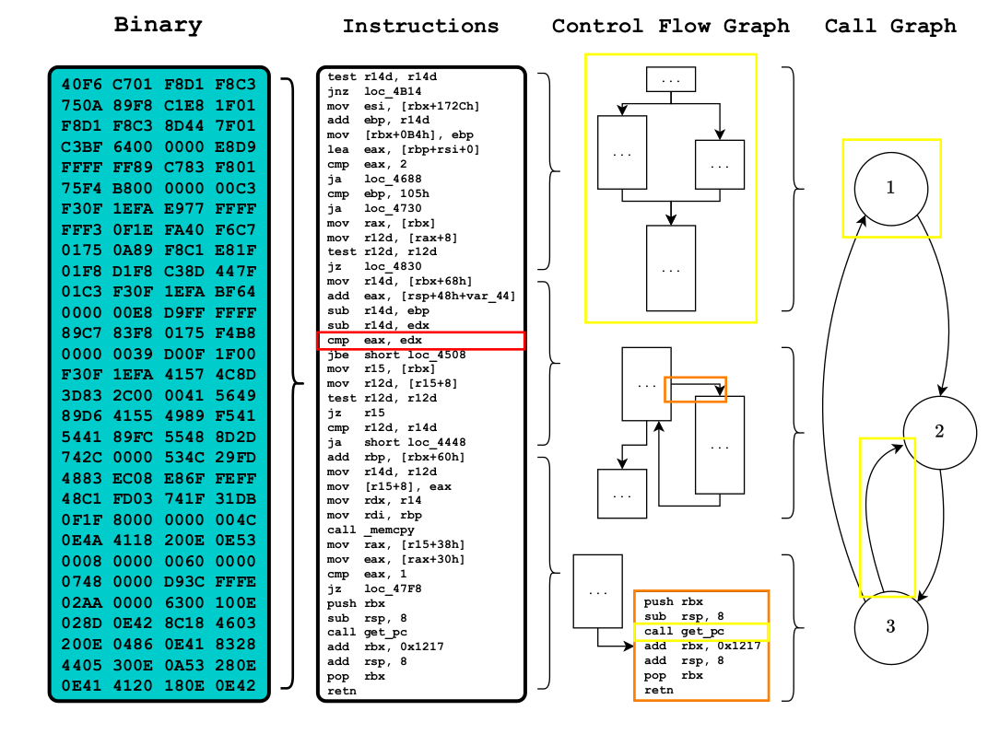

Binary diffing
==============

Binary diffing aims to automatically compare two binaries, called primary and secondary, based on their machine code or assembly. 

To start, we recall some definitions.

Control-Flow Graph
------------------

A function may consists of several basic blocks. A basic block is made of instructions that are consecutively executed. A Control-Flow Graph then represents the intraprocedural relation between basic blocks inside a function.

Function Call Graph
-------------------

A Function Call Graph follows the same principle but displays the interprocedural relationships between functions of a program. 

[TODO:cite the Elie PhD for the picture]
In this image, you can see the difference between the Control-Flow Graph (CG) or the Functin Call Graph or Call Graph (CG). What changes is the level or the granularity of what we look at. 

Method
------

In general, we try to find a one-to-one correspondence between elements of the binaries. The elements may be located at different granularities. Indeed, we usually want to find correspondances at the function level. In other words, we want to match or not each function in the primary versus each function in the secondary. The matching may also happen at the basic block level (but this is more difficult).

QBinDiff operates both on binaries and generic graphs. Indeed, graph matching is not limited to binary diffing only. That is why you should consider the terms "binary" and "graph" as swappable [TODO: add bold or italic].

QBinDiff internally works in a specific way, that is not strictly necessary to know this it might be helpful to better understand how to fine tune the parameters for a specific diffing task.

From a high level prespective, QBinDiff operates in the following steps:

1. Differ object creation with several parameters. [TODO: add link to parameters]
2. Core of the diffing process. In the end, a mapping between the most similar functions is produced. This step is performed in multiple substeps:
   1. Ancoring step
   2. Analysis of non-imported functions by extracting features and combining them into a similarity matrix with a linear combination and a distance computation. [TODO:add link to feat]
   2. Optionally performing user defined similarity matrix refinements
   3. Combining the similarity matrix and the topology of the CG with a state-of-the-art machine learning algorithm, called Belief Propagation, [TODO:add link]to produce the functions mapping
3. Export the result in different formats

One step in the QBinDiff framework is particularly important : the anchoring phase, only available for binaries. Indeed, binaries often contain imported functions. These functions can be common to primary and secondary. Using them as anchors greatly help the differ to obtain good matches. 

Supported files 
---------------

QBinDiff may theoretically support any file that can be exported to BinExport or Quokka files. This includes classical x86, x86_64, ARM. [TODO:check again for arm and other arch]. But, remember QBinDiff is heavily dependant about the exported files. BinExport and Quokka depend on your disassembly tool (such as IDA for Quokka and BinExport and Ghidra for BinExport only). If your file cannot be disassembled, your diffing results will be useless. The same holds for BinExport : this file format tends to have several drawbacks for very specific cases. 

QBinDiff will then correctly work for binaries that are "regular" enough. If you want to use QBinDiff to diff two baremetal firmwares for example, you may enter into troubles (missing nodes in the flowgraph for example). 
