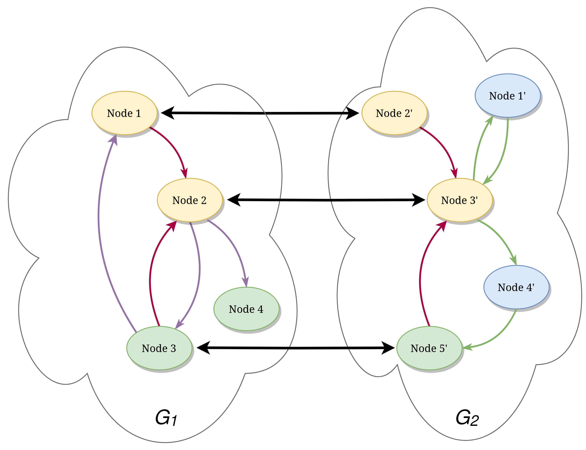

Introduction
============

QBinDiff is an experimental binary-diffing tool addressing the diffing as a `Network Alignement Quadratic Problem <https://www.sciencedirect.com/science/article/abs/pii/0377221784900936>`_.

> But why developing yet another differ while Bindiff works well?

Bindiff is great, no doubt about it, but we have no control on the diffing process. Also, it works great on standard binaries but it lacks flexibility on some corner-cases (embedded firmwares, diffing two portions of the same binary etc).

A key idea of QBinDiff is enabling tuning the diffing programmatically by:

- writing its own features
- being able to enforce some matches
- emphasizing either on the content of functions (similarity) or the links between them (callgraph)

In essence, the idea is to be able to diff by defining its own criteria which sometimes, is not the control-flow and instructions but could for instance, be data-oriented.

Last, QBinDiff has primarily been designed with the binary-diffing use-case in mind, but it can be applied to various other use-cases like social-networks. Indeed, diffing two programs boils down to determining the best alignment of the call graph following some similarity criterion.

Indeed, solving this problem is APX-hard, that why QBinDiff uses a machine learning approach (more precisely optimization) to approximate the best match.

Like Bindiff, QBinDiff also works using an exported disassembly of program obtained from IDA. Originally using `BinExport <https://github.com/google/binexport>`_, it now also supports `Quokka <https://github.com/quarkslab/quokka>`_ as backend, which extracted files, are more exhaustive and also more compact on disk (good for large binary dataset).

.. warning:: QBinDiff is an experimental tool for power-user where many parameters, features, thresholds or weights can be adjusted. Obtaining good results usually requires tuning these parameters.

.. note:: QBinDiff does not intend to be faster than other differs, but rather being more flexible.

.. warning:: Right now there are some limitations on the size of the binaries that can be diffed. Trying to handle binaries with more than 10 000 functions might result in Out of Memory errors.

The diffing problem
-------------------

Formally, we define the graph matching problem as the process of **aligning** two attributed
directed graphs, where the term *align* means finding the **best mapping** between the nodes of the
first graph (called *primary*) to the the nodes of the second one (called *secondary*). In this
case what exactly characterizes the **best** mapping is intentionally left undefined as there are
multiple ways of defining what a good match (between two nodes) is. It usually depends on the nature
of the underlying problem instance solved. For example, in binary diffing, we might consider a match between
two functions to be good (aka valuable) if the two functions are in fact semantically equal or
similar enough, although on the other hand we might also be interested in evaluating how much they
syntactically differ, hence, a good alignment has to leverage the similarity between the nodes.
In other scenarios, instead, we might be more focused on the topological similarity of the two nodes,
that means relying less on the nodes attributes and more on the call graph (i.e.: graph topology).

    Representation of the *graph alignment* problem where we are considering both topological information (the edges) and node attributes (the colors). The black bold arrows represent the **alignment** (mapping).

The *graph alignment* problem has been analyzed in many research papers [#]_ [#]_ [#]_ and is an
`APX-hard <https://en.wikipedia.org/wiki/APX>`_ problem. However, the underlying issue of lacking a unique general definition for a
*good* mapping between the nodes makes it difficult to solve.

.. [#] Burkard, Rainer E. (Mar. 1984). *Quadratic assignment problems*. *European Journal of Operational Research* 15.3, pp 283-289.
.. [#] Bayati, Mohsen et al. (Dec. 2009). *Algorithms for Large, Sparse Network Alignment Problems*. *Proceedings of the 2009 Ninth IEEE International Conference on Data Mining*. ICDM '09 USA: IEEE Computer Society, pp, 705-710.
.. [#] Klau, Gunnar W. (Jan. 2009). *A new graph-based method for pairwise global network alignment*. *BMC Bioinformatics* 10.1, S59.

QBinDiff adopts a unique strategy to combine both the domain specific knowledge **and** a general
theoretical algorithm for graph alignment. It uses two kinds of information:

- A similarity matrix between nodes of the two graphs (domain specific).
- The topology similarity between the two graphs.

It then uses a state-of-the-art machine learning algorithm based on belief propagation to combine these
two information sources, using a tradeoff parameter (:math:`\alpha`) to weight the importance of each, to compute
the approximated final mapping between the two graphs.

This approach has the advantage of being versatile, so that it can be applied to different instances
of the diffing problem, and it leaves the user a lot of space for customizing and tuning the
algorithm. In fact, depending on the problem type, some heuristics might be more suitable than
others and sometimes we might rely more on the graph topology instead of the similarity or vice
versa.
